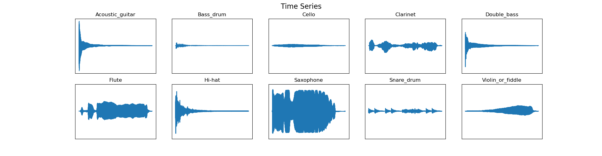
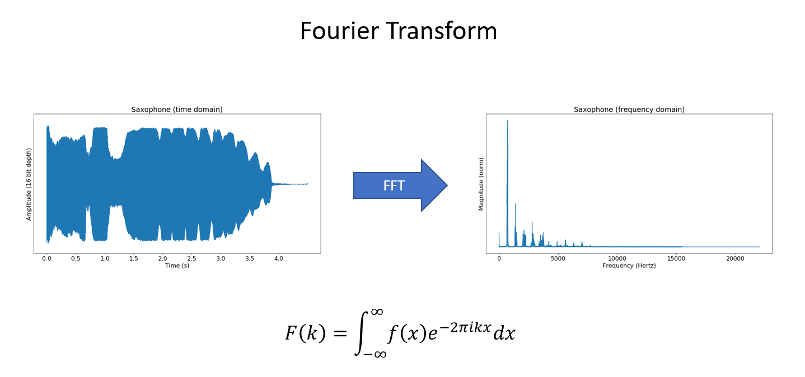
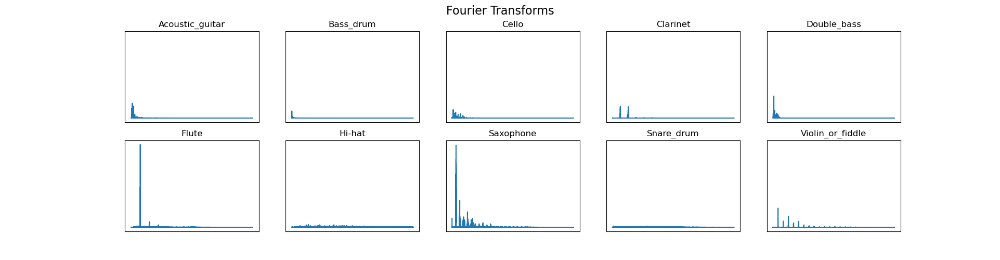
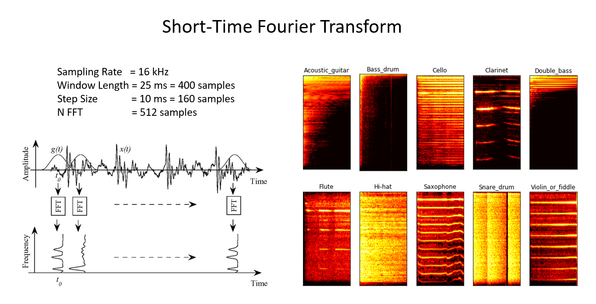
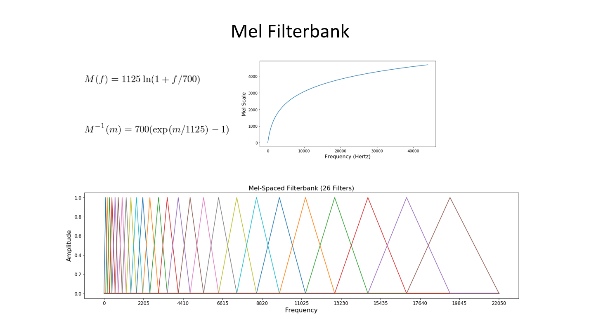
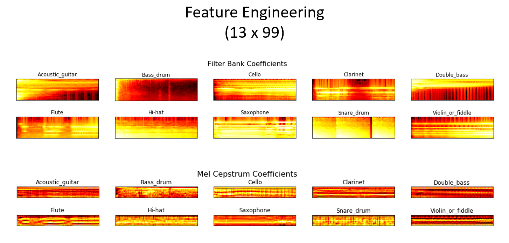
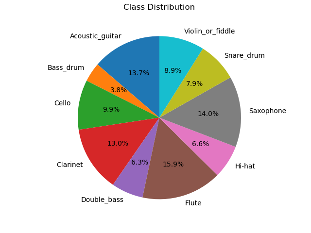
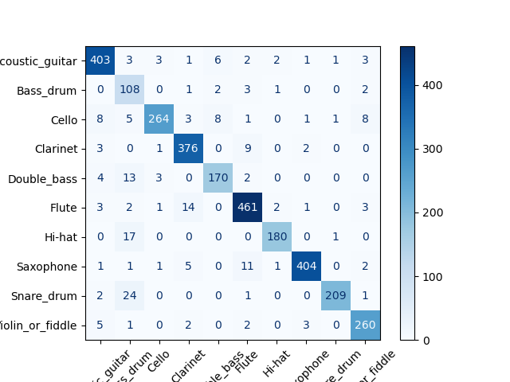
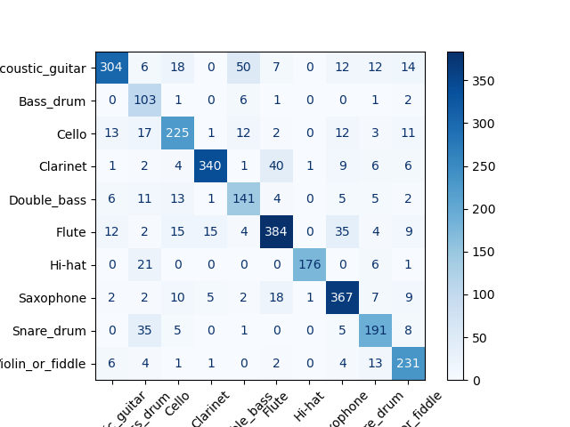

# Two-Fold Sound Classification Project
## Introduction
The following report represents a sound classification project split in two parts: **Digital Signal Processing**, which acts as a Data Preprocessing step, and **Neural Networks** which describes the rest of the AI training workflow.

This project is based on the following [playlist](https://www.youtube.com/playlist?list=PLhA3b2k8R3t2Ng1WW_7MiXeh1pfQJQi_P).

> Sidenote: Despite the fact that the playlist is old and uses *Keras*, it is a very good playlist for better understanding of DSP filtering and compression, and AI training. It is used only for educational purposes.

The dataset used for this project is [Freesound General-Purpose Audio Tagging Challenge](https://www.kaggle.com/c/freesound-audio-tagging). Only a small portion of it was used in the project, particularly musical instruments.

This report will lead the reader from the recorded sounds to their classifications step by step.

## Digital Signal Processing
The dataset consists of raw sound recordings of different real-world entities/actions. In this case, musical instruments were recorded with a microphone with a bit rate of 16 at a sample rate of 44.1 kHz. Here is the overview of the audio plotted:



As it can be seen, it is not quite obvious for user to understand what each graph represents without labeling, the same confusion will propagate to the AI model. This is why we need to perform some processing steps.

### Fourier Transform
The very first step that has to be performed is the application of Fast Fourier Transform, an efficient algorithm for calculating Discrete Fourier Transform, which moves the raw recording we obtained from time domain to frequency domain.


Example:


It appears that most useful harmonics are below 8 KHz, meaning that everything above can be discarded in order to save space and make computations faster. The audio is resampled from 44.1 kHz to 16 kHz using `Librosa`. The resampling algorithm applies anti-alias filtering before downsampling, effectively suppressing unwanted high-frequency content.

### Short-time Fourier Transform
Since a simple FFT will output all the frequencies found in the whole audio regardless of their position in time, the current strategy should be improved. The idea is to split the audio into small pieces so that found frequencies can obtain position in time and a spectrogram can be built which is essentially a graph with time as an X-axis and frequency as a Y-axis stacking FFT results adjacent to each other.


But simple splitting is not enough, instead of solely splitting audio into a number of small frames, a windowing with overlapping should be applied which is used by Short-time Fourier Transform algorithm.



And the most signifacant result that we achieve is the **variation of frequency over time**.

### Envelope


In the recordings silence can be found which can also be removed for computation accelerating. The envelope of a signal can be used as a silence gate. It identifies portions of the waveform whose amplitude is above a threshold and removes portions whose amplitude is very small.

```python
def envelope(y, rate, threshold):
    mask = []
    y = pd.Series(y).apply(np.abs)
    y_mean = y.rolling(window=int(rate/10), min_periods=1, center=True).mean()
    for mean in y_mean:
        if mean > threshold:
            mask.append(True)
        else:
            mask.append(False)
    return mask
```

Instead of looking at each sample individually (which is very noisy), the algorithm looks at a local neighborhood around each point. It computes a moving average of the absolute signal amplitude.

### Mel Frequency and MFCC

The Mel scale relates perceived frequency, or pitch, of a pure tone to its actual measured frequency. Humans are much better at discerning small changes in pitch at low frequencies than they are at high frequencies. Incorporating this scale makes our features match more closely what humans hear. Moreover, applying mel filterbanks log-mel energies act as an output and the spectrogram becomes even lighter.



There is another problem: the log-mel filterbank energies are highly correlated due to overlapping filters and the smooth nature of speech/instrument spectra. To reduce redundancy and obtain a more compact representation, a Discrete Cosine Transform (DCT) is applied, producing the Mel-Frequency Cepstral Coefficients (MFCCs), which decorrelate the features and compress the spectral information, it acts like a low-pass filter in the cepstral domain.



### References
- DSP Background - Deep Learning for Audio Classification p.1 ([link](https://www.youtube.com/watch?v=Z7YM-HAz-IY&list=PLhA3b2k8R3t2Ng1WW_7MiXeh1pfQJQi_P&index=1))
- Mel Frequency Cepstral Coefficient (MFCC) tutorial ([link](http://practicalcryptography.com/miscellaneous/machine-learning/guide-mel-frequency-cepstral-coefficients-mfccs/))
- Speech Processing for Machine Learning: Filter banks, Mel-Frequency Cepstral Coefficients (MFCCs) and What's In-Between ([link](https://haythamfayek.com/2016/04/21/speech-processing-for-machine-learning.html))
- Discrete Cosine Transformations ([link](http://datagenetics.com/blog/november32012/index.html))
- Audio Signal Processing for Machine Learning Playlist ([link](https://www.youtube.com/playlist?list=PL-wATfeyAMNqIee7cH3q1bh4QJFAaeNv0))

## Neural Networks and Genetic Algorithms
Having prepared the theoretical framework, it is time to move to the practical part of the project.

### Dataset

A small part of ["Freesound General-Purpose Audio Tagging Challenge"](https://www.kaggle.com/c/freesound-audio-tagging) is used as a dataset for this project. Here is the class distribution:



### Data Preprocessing
In this section the envelope of signal is found and resampling is applied as it was discussed in the previous sections.

```python
for f in tqdm(df.fname):
    signal, rate = librosa.load('wavfiles/' + f, sr = 16000)
    mask = envelope(signal, rate, 0.0005)
    wavfile.write(filename='clean/' + f, rate=rate, data= signal)
```

The full code for this section can be found [here](eda.py).
### Data Preparation
The file `instruments.csv` contains correct labeling for each .wav file. But since the audio files are of different lengths, data normalization should be applied.

Let us take a look at them separately.

1. Since audio files' length is inconsistent, the raw data we have is not compatible with Deep Learning model which requires fixed-size inputs. The following code creates a uniform dataset by extracting random fixed-length segments from each audio file.

```python
X = []
y = []

# Initialize global maximum and minimum
_min, _max = float('inf'), -float('inf')
# tqdm is optional, just for minimal UI
for _ in tqdm(range(n_samples)):
    # Choose class based on the class probability distribution
    rand_class = np.random.choice(class_dist.index, p=prob_dist)
    # Choose a random file that belongs to the chosen class
    file = np.random.choice(df[df.label==rand_class].index)
    rate, wav = wavfile.read('clean/'+file)
    label = df.at[file, 'label']
    # Choose a random position from where to take a segment
    rand_index = np.random.randint(0, wav.shape[0] - config.step)
    sample = wav[rand_index:rand_index + config.step]
    # Calculate MFCC on it
    X_sample = mfcc(sample, rate, numcep=config.nfeat, 
                    nfilt=config.nfilt, nfft=config.nfft)
    # Update global minimum and maximum if needed
    _min = min(np.amin(X_sample), _min)
    _max = max(np.amax(X_sample), _max)
    X.append(X_sample)
    y.append(classes.index(label))
config.min = _min
config.max = _max
```
2. Now it is time to normalize dataset.

```python
# Turn lists into NumPy arrays
X, y = np.array(X), np.array(y)
# Normalize to [0, 1] range
X = (X - _min) / (_max - _min)
if config.mode == 'conv':
    # CNN needs number of color channels
    # samples, time, mfcc, 1 (grayscale channel)
    X = X.reshape(X.shape[0], X.shape[1], X.shape[2], 1)
elif config.mode == 'time':
    # samples, time, mfcc
    X = X.reshape(X.shape[0], X.shape[1], X.shape[2])

# Since we perform classification task, one-hot encoding is must-have here.
y = to_categorical(y, num_classes=10)
config.data = (X, y)
```
3. Put X and y vectors to cache and reuse them

```python
with open(config.p_path, 'wb') as handle:
    # Pickling is translating Python objects to a form that can easily be saved to disk
    # We save objects to make them reusable
       pickle.dump(config, handle, protocol=pickle.HIGHEST_PROTOCOL)   
return X,y

#------------------------------

def check_data():
    if os.path.isfile(config.p_path):
        print('Loading existing data for {} model'.format(config.mode))
        with open(config.p_path, 'rb') as handle:
            tmp = pickle.load(handle)
            return tmp
    else:
        return None

def build_rand_feat():
    # If we find data in cache, load it
    # Skip all the preparation steps
    tmp = check_data()
    if tmp:
        return tmp.data[0], tmp.data[1]
```

The full code snippet:
```python
def check_data():
    if os.path.isfile(config.p_path):
        print('Loading existing data for {} model'.format(config.mode))
        with open(config.p_path, 'rb') as handle:
            tmp = pickle.load(handle)
            return tmp
    else:
        return None

def build_rand_feat():
    tmp = check_data()
    if tmp:
        return tmp.data[0], tmp.data[1]
    X = []
    y = []
    _min, _max = float('inf'), -float('inf')
    for _ in tqdm(range(n_samples)):
        rand_class = np.random.choice(class_dist.index, p=prob_dist)
        file = np.random.choice(df[df.label==rand_class].index)
        rate, wav = wavfile.read('clean/'+file)
        label = df.at[file, 'label']
        rand_index = np.random.randint(0, wav.shape[0] - config.step)
        sample = wav[rand_index:rand_index + config.step]
        X_sample = mfcc(sample, rate, numcep=config.nfeat, 
                        nfilt=config.nfilt, nfft=config.nfft)
        _min = min(np.amin(X_sample), _min)
        _max = max(np.amax(X_sample), _max)
        X.append(X_sample)
        y.append(classes.index(label))
    config.min = _min
    config.max = _max
    X, y = np.array(X), np.array(y)
    X = (X - _min) / (_max - _min)
    if config.mode == 'conv':
        X = X.reshape(X.shape[0], X.shape[1], X.shape[2], 1)
    elif config.mode == 'time':
        X = X.reshape(X.shape[0], X.shape[1], X.shape[2])
    y = to_categorical(y, num_classes=10)
    config.data = (X, y)
    
    with open(config.p_path, 'wb') as handle:
        pickle.dump(config, handle, protocol=pickle.HIGHEST_PROTOCOL)
    
    return X,y
``` 


### Model
The data is prepared, now the model should be discussed. There are two approaches that can be used in this problem: \
- Convolutional Neural Networks
- Long Short-Term Memory (Recurrent Neural Networks)

We will design both models and evaluate them after training.

#### Convolutional Neural Networks

Theoretically, we can use CNNs as image classifiers, because every instrument's "profile" looks differently.

```python
def get_conv_model():
    model = Sequential()
    model.add(Input(shape=input_shape))
    # Convolutions act like filters
    # Each layer learns progressively more complex patterns
    model.add(Conv2D(16, (3,3), activation='relu', 
                     strides=(1,1), padding='same'))
    model.add(Conv2D(32, (3, 3), activation='relu', strides=(1, 1),
                     padding='same'))
    model.add(Conv2D(64, (3, 3), activation='relu', strides=(1, 1),
                     padding='same'))
    model.add(Conv2D(128, (3, 3), activation='relu', strides=(1, 1),
                     padding='same'))
    # Now reduce resolution by keeping only the strongest activations
    model.add(MaxPool2D((2,2)))
    # Disable randomly 50% of neurons
    # to generalize dataset better
    model.add(Dropout(0.5))
    # Turn 2D vector into 1D one.
    model.add(Flatten())
    # “Decision-making layers” after feature extraction
    model.add(Dense(128, activation="relu"))
    model.add(Dense(64, activation="relu"))
    # Softmax for classification
    model.add(Dense(10, activation="softmax"))
    model.summary()
    # We use it because it is a multi-class classification problem
    model.compile(loss='categorical_crossentropy',
        # Optimizing learning rate, classic option
                  optimizer='adam',
                  metrics=['acc'])
    return model
```

#### Long Short-Term Memory
LSTM treats input vector as a time sequence of feature vectors, so intuitively thinking, this approach should perfectly fit input vectors that represent temporal changes.

```python
def get_recurrent_model():
    model = Sequential()
    model.add(Input(shape=input_shape))
    # Processes frame by frame and tries to understand the sequence
    model.add(LSTM(128, return_sequences=True))
    # Process again to refine understanding
    model.add(LSTM(128, return_sequences=True))
    model.add(Dropout(0.5))
    # Apply Dense layer independently at every time step
    model.add(TimeDistributed(Dense(64, activation='relu')))
    model.add(TimeDistributed(Dense(32, activation='relu')))
    model.add(TimeDistributed(Dense(16, activation='relu')))
    model.add(TimeDistributed(Dense(8, activation='relu')))
    # Last steps are the same
    model.add(Flatten())
    model.add(Dense(10, activation='softmax'))
    model.summary()
    model.compile(loss='categorical_crossentropy',
                  optimizer='adam',
                  metrics=['acc'])
    return model
```
#### Training
In order to be flexible and modular, the following class was written.

```python
class Config:
    # Rate is 16 KHz because the original audio was resampled
    # Step gives us a 100 ms window
    # 512 samples fit in the window size (32 ms)
    # 26 Mel filterbanks
    # 13 numbers of MFCC coefficients (we don't need much details)
    def __init__(self, mode='conv', nfilt=26, nfeat=13, nfft=512, rate=16000):
        self.mode = mode
        self.nfilt = nfilt
        self.nfft = nfft
        self.nfeat = nfeat
        self.rate = rate
        self.step = int(rate/10)
        self.model_path = os.path.join('models', mode + '.keras')
        self.p_path = os.path.join('pickles', mode +'.p')
```

Now the initializtion step:

```python
# Read labels for each audio file
df = pd.read_csv('instruments.csv')
df.set_index('fname', inplace=True)

for f in df.index:
    rate, signal = wavfile.read('clean/'+f)
    df.at[f, 'length'] = signal.shape[0]/rate

# Calculate the class probability distribution
class_dist = df.groupby(['label'])['length'].mean()

label_names = [str(c) for c in np.unique(df.label)]

config = Config(mode='conv')

# CNN
if config.mode == 'conv':
    X, y = build_rand_feat()
    y_flat = np.argmax(y, axis=1)
    input_shape = (X.shape[1], X.shape[2], 1)
    model = get_conv_model()

# LSTM    
elif config.mode == 'time':
    X, y = build_rand_feat()
    y_flat = np.argmax(y, axis=1)
    input_shape = (X.shape[1], X.shape[2])
    model = get_recurrent_model()
    
classes = np.unique(y_flat)

# 
class_weights_raw = compute_class_weight(
    class_weight='balanced',
    classes=classes,
    y=y_flat
)

class_weight = dict(zip(classes, class_weights_raw))

# Save the best model based on the accuracy
checkpoint = ModelCheckpoint(
    config.model_path,
    monitor='val_accuracy',
    verbose=1,
    mode='max',
    save_best_only=True,
    save_weights_only=False
)

# Set a bigger number of epochs
# Stop when the best performance reached
early_stop = EarlyStopping(
    monitor='val_loss',
    patience=3,
    restore_best_weights=True
)

# 80% - training data
X_train, X_temp, y_train, y_temp = train_test_split(
    X, y, test_size=0.2, random_state=42, stratify=y
)

# 10% - validation data
# 10% - test data 
X_val, X_test, y_val, y_test = train_test_split(
    X_temp, y_temp, test_size=0.5, random_state=42, stratify=y_temp
)

# Train model
history = model.fit(
    X_train,
    y_train,
    validation_data = (X_val, y_val),
    epochs=50,
    callbacks=[early_stop, checkpoint],
    batch_size=32,
    class_weight=class_weight
)
```

CNN
```
Model: "sequential"
┌─────────────────────────────────┬────────────────────────┬───────────────┐
│ Layer (type)                    │ Output Shape           │       Param # │
├─────────────────────────────────┼────────────────────────┼───────────────┤
│ conv2d (Conv2D)                 │ (None, 9, 13, 16)      │           160 │
├─────────────────────────────────┼────────────────────────┼───────────────┤
│ conv2d_1 (Conv2D)               │ (None, 9, 13, 32)      │         4,640 │
├─────────────────────────────────┼────────────────────────┼───────────────┤
│ conv2d_2 (Conv2D)               │ (None, 9, 13, 64)      │        18,496 │
├─────────────────────────────────┼────────────────────────┼───────────────┤
│ conv2d_3 (Conv2D)               │ (None, 9, 13, 128)     │        73,856 │
├─────────────────────────────────┼────────────────────────┼───────────────┤
│ max_pooling2d (MaxPooling2D)    │ (None, 4, 6, 128)      │             0 │
├─────────────────────────────────┼────────────────────────┼───────────────┤
│ dropout (Dropout)               │ (None, 4, 6, 128)      │             0 │
├─────────────────────────────────┼────────────────────────┼───────────────┤
│ flatten (Flatten)               │ (None, 3072)           │             0 │
├─────────────────────────────────┼────────────────────────┼───────────────┤
│ dense (Dense)                   │ (None, 128)            │       393,344 │
├─────────────────────────────────┼────────────────────────┼───────────────┤
│ dense_1 (Dense)                 │ (None, 64)             │         8,256 │
├─────────────────────────────────┼────────────────────────┼───────────────┤
│ dense_2 (Dense)                 │ (None, 10)             │           650 │
└─────────────────────────────────┴────────────────────────┴───────────────┘
 Total params: 499,402 (1.91 MB)
 Trainable params: 499,402 (1.91 MB)
 Non-trainable params: 0 (0.00 B)
```

LSTM

```
┌─────────────────────────────────┬────────────────────────┬───────────────┐
│ Layer (type)                    │ Output Shape           │       Param # │
├─────────────────────────────────┼────────────────────────┼───────────────┤
│ lstm (LSTM)                     │ (None, 9, 128)         │        72,704 │
├─────────────────────────────────┼────────────────────────┼───────────────┤
│ lstm_1 (LSTM)                   │ (None, 9, 128)         │       131,584 │
├─────────────────────────────────┼────────────────────────┼───────────────┤
│ dropout_1 (Dropout)             │ (None, 9, 128)         │             0 │
├─────────────────────────────────┼────────────────────────┼───────────────┤
│ time_distributed                │ (None, 9, 64)          │         8,256 │
│ (TimeDistributed)               │                        │               │
├─────────────────────────────────┼────────────────────────┼───────────────┤
│ time_distributed_1              │ (None, 9, 32)          │         2,080 │
│ (TimeDistributed)               │                        │               │
├─────────────────────────────────┼────────────────────────┼───────────────┤
│ time_distributed_2              │ (None, 9, 16)          │           528 │
│ (TimeDistributed)               │                        │               │
├─────────────────────────────────┼────────────────────────┼───────────────┤
│ time_distributed_3              │ (None, 9, 8)           │           136 │
│ (TimeDistributed)               │                        │               │
├─────────────────────────────────┼────────────────────────┼───────────────┤
│ flatten_1 (Flatten)             │ (None, 72)             │             0 │
├─────────────────────────────────┼────────────────────────┼───────────────┤
│ dense_7 (Dense)                 │ (None, 10)             │           730 │
└─────────────────────────────────┴────────────────────────┴───────────────┘
 Total params: 216,018 (843.82 KB)
 Trainable params: 216,018 (843.82 KB)
 Non-trainable params: 0 (0.00 B)
```

The whole code for this section can be found [here](model.py).

#### Results

For CNN, it took 17 epochs to train to its best.
```
Test Accuracy: 0.9310344827586207

Classification Report:
                  precision    recall  f1-score   support

 Acoustic_guitar       0.94      0.95      0.94       425
       Bass_drum       0.62      0.92      0.74       117
           Cello       0.97      0.88      0.92       299
        Clarinet       0.94      0.96      0.95       391
     Double_bass       0.91      0.89      0.90       192
           Flute       0.94      0.95      0.94       487
          Hi-hat       0.97      0.91      0.94       198
       Saxophone       0.98      0.95      0.96       426
      Snare_drum       0.99      0.88      0.93       237
Violin_or_fiddle       0.93      0.95      0.94       273

        accuracy                           0.93      3045
       macro avg       0.92      0.92      0.92      3045
    weighted avg       0.94      0.93      0.93      3045
```



For LSTM, it took 13 epochs to train to its best.
```
Test Accuracy: 0.8085385878489326

Classification Report:
                  precision    recall  f1-score   support

 Acoustic_guitar       0.88      0.72      0.79       423
       Bass_drum       0.51      0.90      0.65       114
           Cello       0.77      0.76      0.77       296
        Clarinet       0.94      0.83      0.88       410
     Double_bass       0.65      0.75      0.70       188
           Flute       0.84      0.80      0.82       480
          Hi-hat       0.99      0.86      0.92       204
       Saxophone       0.82      0.87      0.84       423
      Snare_drum       0.77      0.78      0.77       245
Violin_or_fiddle       0.79      0.88      0.83       262

        accuracy                           0.81      3045
       macro avg       0.80      0.82      0.80      3045
    weighted avg       0.82      0.81      0.81      3045
```



### References
- Deep Learning for Audio Classification ([link](https://www.youtube.com/playlist?list=PLhA3b2k8R3t2Ng1WW_7MiXeh1pfQJQi_P))
- Convolutional Neural Networks from Scratch | In Depth ([link](https://www.youtube.com/watch?v=jDe5BAsT2-Y))
- Backpropagation in Convolutional Neural Networks (CNNs) ([link](https://www.youtube.com/watch?v=z9hJzduHToc))
- LSTM Networks - EXPLAINED! ([link](https://www.youtube.com/watch?v=QciIcRxJvsM))
- Neural Networks: Zero to Hero ([link](https://www.youtube.com/playlist?list=PLAqhIrjkxbuWI23v9cThsA9GvCAUhRvKZ))

## Conclusions

In conclusion, it is evident that Convolutional Neural Network perfoms much better than Long Short-Term Memory in spite of being larger and converging later than it. The difference is significant making CNN much more reliable than LSTM. In addition, the CNN produced higher precision, recall, and F1-scores across most instrument classes. The confusion matrices further show that the CNN was able to distinguish between instruments with similar timbral characteristics more effectively than the LSTM.

Prior to feature extraction, the audio signals were resampled to 16 kHz and cleaned using an envelope-based thresholding method to remove low-energy regions. Fixed-length audio segments were then extracted from recordings of varying durations, allowing the construction of a balanced dataset suitable for supervised learning.

The fact that the LSTM performs worse supports the idea that local time-frequency structure is more important than long temporal context for short instrument excerpts. Moreover, bass drum is the most challenging class for both models (CNN precision only 0.62, LSTM precision 0.51), indicating frequent false positives.


Wrapping up, the findings indicate that MFCC-based CNN architectures provide an effective solution for musical instrument classification. Future work could investigate alternative feature representations such as log-mel spectrograms, data augmentation techniques, deeper convolutional architectures, or transformer-based models to further improve classification accuracy and robustness, and consideration of implementation of real-time model.
